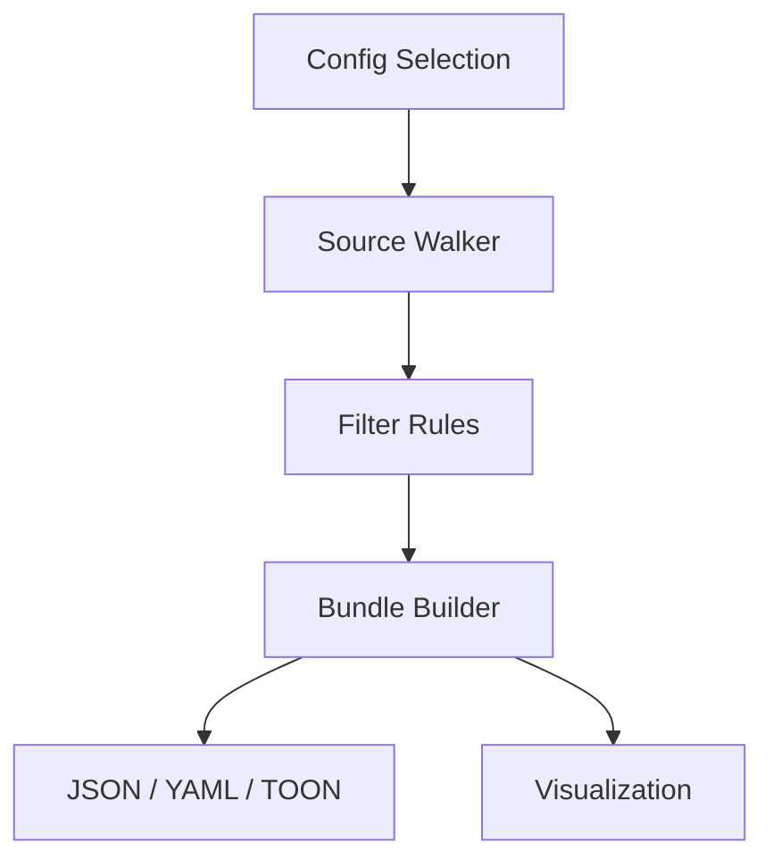
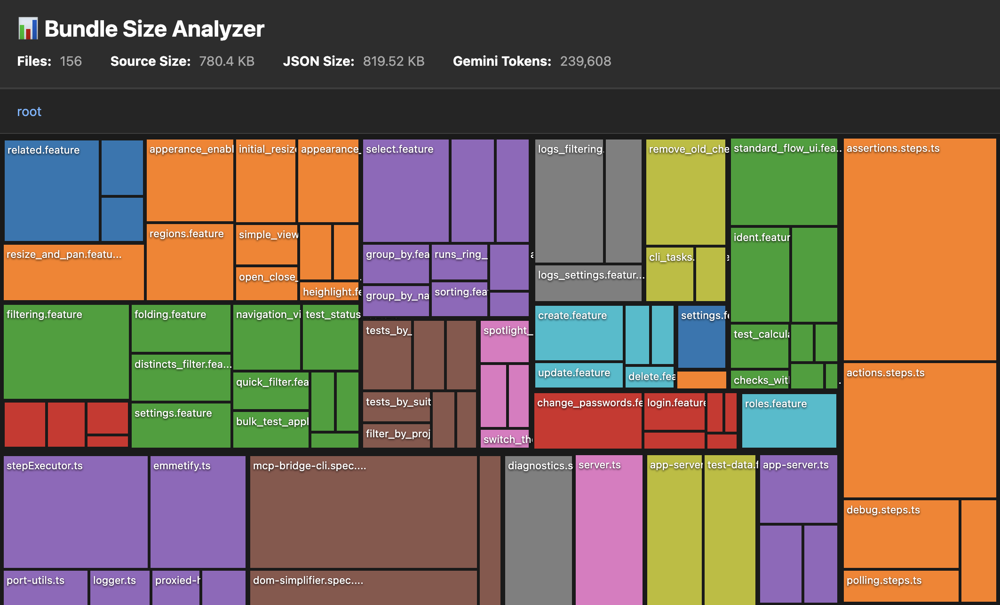

# src-to-llm

Minimal CLI that walks project sources, filters them by config, and writes JSON, YAML, or TOON output plus a visualization for quick bundle review.

## Visualization Overview


### Visualization Bundle Summary


## Requirements
- Node.js 18+
- Yarn 1.x

## Getting Started
1. Install dependencies: `yarn`
2. Choose a config and export code: `yarn start`
3. Verify types: `yarn typecheck`
4. Run the minimal validation tests: `yarn test`

## Output Formats
- `outputFormat` is optional in configs and defaults to `json`
- `outputDir` is optional and defaults to `./out`
- Supported values: `json`, `yaml`, `toon`

## Selecting File Types and Ignore Rules
- Declare `fileTypes` with every extension you want to include (case-sensitive)
- Declare `ignorePaths` with directory names, glob-style suffixes (e.g. `*.log`), or individual files
- Keep patterns repository-relative; the CLI normalizes them before matching

## Creating Custom Configs
Place additional configs under `config/` with the suffix `.config.ts`. Only `config/default.config.ts` is tracked in git; other files stay local.

Example (save as `config/my-app.config.ts`):
```ts
import { SourceConfig } from '../src/types/source-config';

const fileTypes = ['.ts', '.tsx', '.js', '.json'];
const ignorePaths = ['node_modules', 'dist', 'storybook-static'];

export const myAppConfig: SourceConfig = {
  description: 'Collect the core sources for My App',
  packageName: 'my-app',
  paths: ['../my-app/src', '../my-app/packages/utils'],
  fileTypes,
  ignorePaths,
  outputFormat: 'toon'
};
```

Run `yarn start`, pick `my-app` (configs are listed by `packageName`), and find the generated artifacts inside `out/<packageName>/`.
